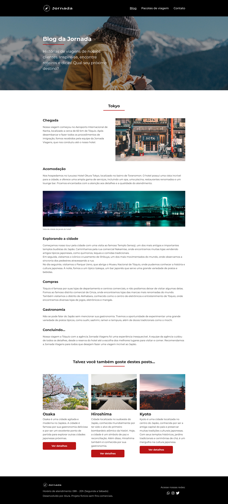
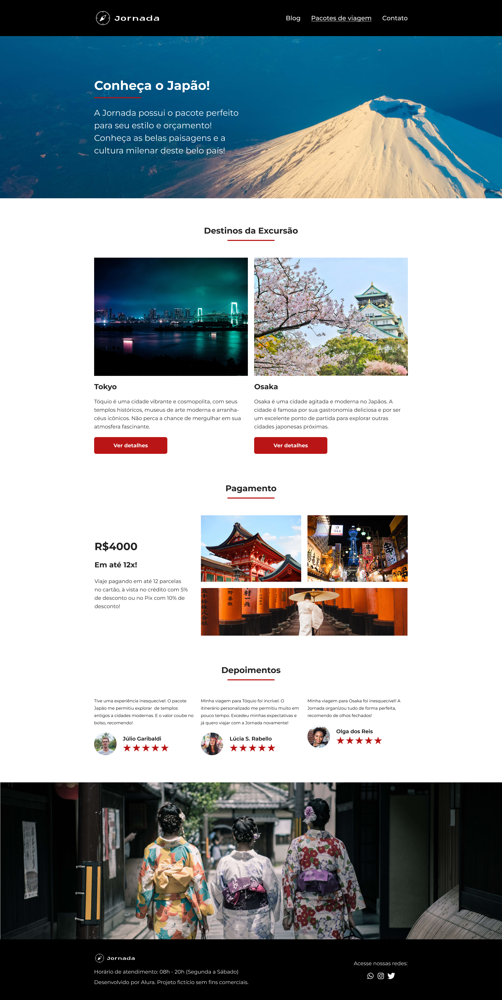
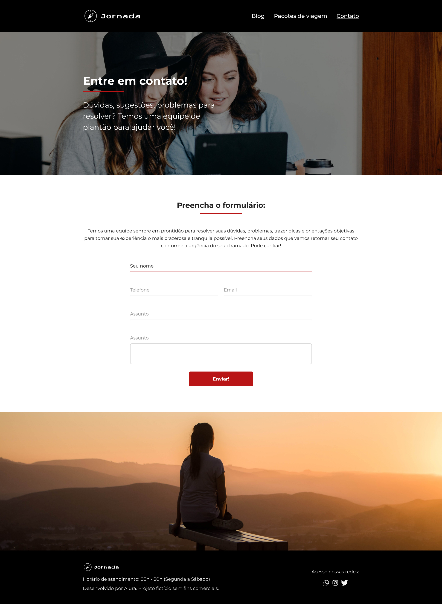

<h1 align="center"> 
Jornada
</h1>

⚙️ Página web de uma agência de viagens desenvolvida durante o Oracle Next Education-T7 explorando a semântica no HTML e a acessibilidade com a ajuda da IA (Luri). ⚙️

 

  

  
  

 

  
  

 

## 🛠 Tecnologias

Esse projeto foi desenvolvido com as seguintes tecnologias:

- **[HTML](#)**
- **[CSS](#)**
- **[IA](#)**
- **[Figma](#)**
- **[BEM](#)**

 

## 🎨 Layout

Você pode visualizar o layout do projeto através [DESSE LINK](https://www.figma.com/design/26Hj19Lzg0mw4pK5yJGuyb/IA-no-Front-end---Jornada-Viagens?node-id=468-3662&node-type=section&t=8CbYZrj3evStUIt0-0). É necessário ter conta no [Figma](https://figma.com) para acessá-lo.

 

## 📝 License

  

Esse projeto está sob a licença MIT.

 

### 👨‍💻 Autor

 
 <em>Ciro Batista da Silva<em>
 
  

 
👋🏽 Entre em contato!

 

